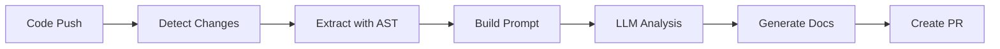

# README-Sync 🔄

**Automatically update your documentation when code changes.**

README-Sync is a GitHub Action that uses AI to keep your documentation in sync with your codebase. It analyzes code changes using AST parsing, generates accurate documentation updates with LLMs, and creates pull requests for review.

## ✨ Features

- **🔬 Structure-Aware Analysis**: Uses AST parsing (not regex) to extract exact function signatures, preventing hallucinations
- **🤖 AI-Powered Updates**: Leverages Google Gemini to generate human-readable documentation
- **🎯 Precision Targeting**: Only updates technical details that changed, preserving your tone and style
- **🔄 Automated PRs**: Creates pull requests instead of direct commits, giving you full control
- **🌐 Multi-Language**: Supports Python, JavaScript, and TypeScript out of the box
- **⚙️ Configurable**: Customize which files to monitor, what to update, and how the AI behaves

## 🚀 Quick Start

### 1. Add to Your Repository

Create `.github/workflows/readme-sync.yml`:

```yaml
name: README Sync

on:
  push:
    branches: [main]

jobs:
  sync-readme:
    runs-on: ubuntu-latest
    steps:
      - uses: actions/checkout@v4
        with:
          fetch-depth: 0
      
      - uses: actions/setup-python@v5
        with:
          python-version: '3.11'
      
      - name: Install README-Sync
        run: |
          pip install -r requirements.txt
      
      - name: Run Sync
        env:
          GEMINI_API_KEY: ${{ secrets.GEMINI_API_KEY }}
        run: python src/sync_readme.py
```

### 2. Configure Secrets

Add your Gemini API key to GitHub Secrets:
1. Go to your repository → Settings → Secrets and variables → Actions
2. Click "New repository secret"
3. Name: `GEMINI_API_KEY`
4. Value: Your API key from [Google AI Studio](https://makersuite.google.com/app/apikey)

### 3. Customize (Optional)

Edit `config.yml` to customize behavior:

```yaml
monitored_extensions:
  - .py
  - .js
  - .ts

documentation_files:
  - README.md
  - docs/API.md

llm:
  model: gemini-1.5-pro
  temperature: 0.3
```

## 📖 How It Works



1. **Trigger**: Runs on every push to main branch
2. **Analysis**: Extracts git diff and parses changed files with AST
3. **Context**: Builds structured prompt with current docs + code changes
4. **Generation**: Sends to Gemini API for intelligent updates
5. **Review**: Creates a PR with the proposed documentation changes

## 🛠️ Configuration Reference

### Monitored Extensions

```yaml
monitored_extensions:
  - .py      # Python
  - .js      # JavaScript
  - .ts      # TypeScript
  - .jsx     # React
  - .tsx     # React TypeScript
```

### Exclude Patterns

```yaml
exclude_patterns:
  - "**/test_*.py"
  - "**/tests/**"
  - "**/node_modules/**"
```

### LLM Settings

```yaml
llm:
  provider: gemini
  model: gemini-1.5-pro    # or gemini-1.5-flash for faster responses
  temperature: 0.3         # Lower = more deterministic
  max_tokens: 4096
```

### Update Rules

```yaml
update_rules:
  preserve_tone: true              # Keep your writing style
  preserve_style: true             # Maintain formatting
  update_technical_details: true   # Update signatures, params
  update_examples: true            # Refresh code examples
  add_breaking_changes_section: true
```

## 🧪 Local Testing

Test the sync locally before pushing:

```bash
# Install dependencies
pip install -r requirements.txt

# Set your API key
export GEMINI_API_KEY="your-key-here"

# Run the sync
python src/sync_readme.py
```

## 🏗️ Architecture

### Components

- **`sync_readme.py`**: Main orchestration script
- **`parsers/`**: Language-specific AST parsers
  - `python_parser.py`: Python AST extraction
  - `javascript_parser.py`: JS/TS regex-based parsing
- **`prompt_builder.py`**: Constructs structured LLM prompts
- **`llm_client.py`**: Gemini API integration

### Parser Example

```python
from parsers import ParserFactory

factory = ParserFactory()
analysis = factory.parse_file("example.py", content)

for func in analysis.functions:
    print(f"{func.name}({', '.join(func.parameters)})")
```

```

## 📚 API Reference

### Test Workflow Module

The `test_workflow.py` module provides example functions for testing README-Sync:

#### `greet_user(name: str) -> str`

Greet a user by name.

**Parameters:**
- `name` (str): The name of the user to greet

**Returns:**
- str: A greeting message

**Example:**
```python
from test_workflow import greet_user
message = greet_user("Alice")
print(message)  # "Hello, Alice! Welcome to README-Sync!"
```

#### `calculate_total(items: list[float]) -> float`

Calculate the total sum of items.

**Parameters:**
- `items` (list[float]): List of numbers to sum

**Returns:**
- float: The total sum of all items

#### `DocumentationHelper`

Helper class for documentation operations.

**Methods:**
- `__init__(project_name: str)`: Initialize with project name
- `update_docs(content: str) -> bool`: Update documentation with new content

## 🤝 Contributing

Contributions welcome! Areas for improvement:

- [ ] Add support for more languages (Go, Rust, Java)
- [ ] Implement proper JS/TS AST parsing (replace regex)
- [ ] Add unit tests
- [ ] Support for other LLM providers (OpenAI, Anthropic)
- [ ] Detect breaking changes automatically

## 📝 License

MIT License - feel free to use in your projects!

## 🙏 Acknowledgments

Built with:
- [Google Gemini](https://ai.google.dev/) for AI-powered documentation
- [PyGithub](https://github.com/PyGithub/PyGithub) for GitHub API
- [GitPython](https://github.com/gitpython-developers/GitPython) for git operations

---

**Made for developers who hate outdated docs**
